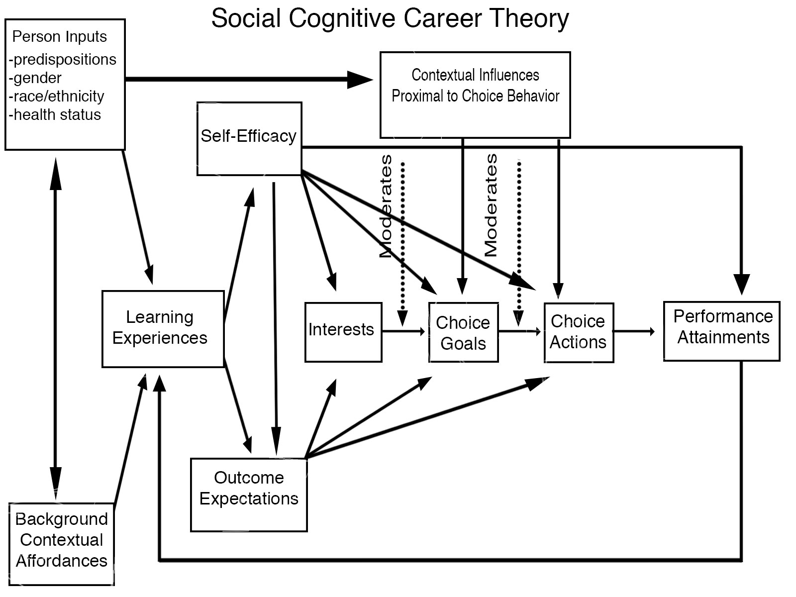
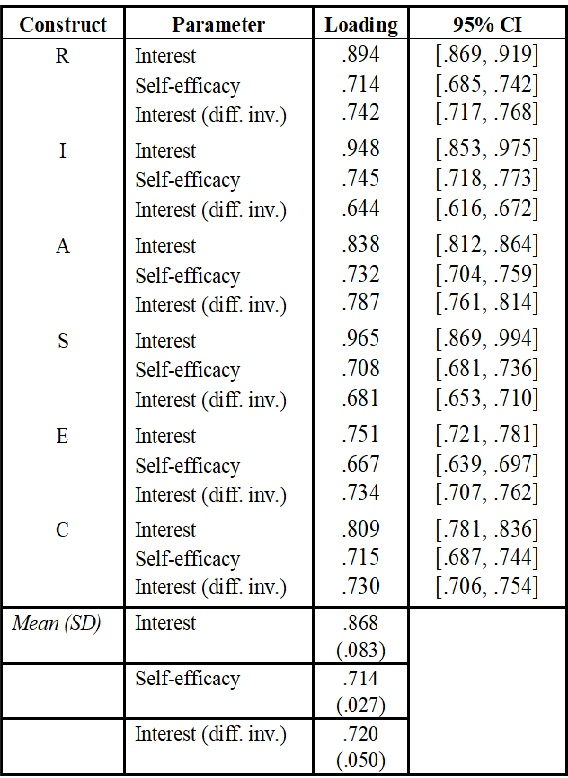

---
                            #color options for background
body_bgcol: "#006747"       #left and right sides (body)
primary_colour: "#CFC493"   #Upper half of middle section (main) and names
secondary_colour: "#EDEBD1" #Bottom half of middle section
accent_colour: "#9CCB3B"    #Color of super scripts and ??
                            #Txt options for title, author, affiliation, etc.
title_textsize: ""          #To change size of title 
title: "Interests and Self Efficacy: Distinct Constructs?"
title_textcol: "#ACEDFF"
author_textsize: ""         #Txt size of author txt
author_textcol:  ""         #Txt color of authors
author:
  - name: Matthew Zimmerman
    affil: 1
    email: mdzimmerman@usf.edu
    main: true
  - name: Brenton Wiernik
    affil: 1
    twitter: bmwiernik
    email: wiernik@usf.edu
    orcid: 
    main: true
affiliation_textcol: "#EDEBD1"     #Color of affiliation txt
affiliation:
  - num: 1
    address: Department of Psycology, University of South Florida
                            #txt options body of poster 
font_family: "Helvetica" 
body_textcol: "#FFFFFF"            #Txt color
body_textsize: "42px"
                            #Txt and images middle section (main) of posterSchoolbell
main_fontfamily: "Helvetica"         #Font (use main_textsize f/ size change)
main_textcol:    "#009374"         #Color of txt 
                            #Content in main section
main_findings:
  - "**Interests** and **self-efficacy** largely capture the **same** underlying attitudes toward work tasks." 
                            #Image middle main, use main_picwidth f/size
  - '{.main_pic}'
main_picwidth: 70%
                            #Bottom left main section image
logoleft_name: '{.main-img-left}'
                            #Bottom right main section image 
logoright_name: '{.main-img-right}' 
                            #Final output options
column_padding:	"15mm"
output: 
  posterdown::posterdown_betterland: 
    self_contained: false
    pandoc_args: --mathjax
    highlight: espresso
    number_sections: false
link-citations: True
bibliography: citations.json
reference_textsize: "20px"
csl: https://www.zotero.org/styles/apa
#After knit open output in browser and then save as PDF, make sure to include background graphics. output directly to pdf is sus.
---

```{r, include=FALSE}
knitr::opts_chunk$set(results = 'asis',
                      echo = FALSE,
                      warning = FALSE,
                      tidy = FALSE,
                      message = FALSE,
                      fig.align = 'center',
                      out.width = "100%")
options(knitr.table.format = "html") 
```

#
- Interactions between interests (**I**) and self-efficacy (**SE**) are used to predict domain relevant career paths.

```{r, echo=FALSE, collapse=TRUE, fig.cap= 'Social Cognitive Career Theory model adopted from Lent et al., 1994', fig.height=3.5, out.width="90%" }

```
- **SE** is a precursor to **I** development, implying the two constructs are ‘related but distinct’. [@lentUnifyingSocialCognitive1994]
- Previous meta-analytic results have found strong mean correlations between the two. [@rottinghausRelationSelfefficacyInterests2003]
- Existing heterogeneity is attributed to tangible differences between the constructs. 

    - But is it more likely that this is due to method effects?
    
# Objectives

- Illuminate potential measurement artefacts between I and SE measures by: 
    1. Determining convergence between I and SE measures. 
    2. Analyzing the structure of cross method correlations.
    3. Using multi-trait multi-method (MMTM) factor analysis for each construct

# Methods
- An exhaustive literature search resulted in 292 studies with unique samples made up of 834,087 people. 
- Correlations were calculated using the R package psychmeta. 
- The MMTM analysis: a correlated-traits, correlated-uniqueness (CTCU) model was fit to a synthetic meta-analytic correlation matrix constructed to reflect meta-analytic mean observed (not corrected for unreliability) correlations among:
   1. Typical RIASEC interest scales
   2. Typical RIASEC self-efficacy scales
   3. RIASEC interest scales drawn from a different inventories
- To account for method variance the uniqueness's for the six scales from the same method to co-vary.
- Confidence intervals, were found through the harmonic mean sample size across included correlations.


# Results


```{r, echo=FALSE,collapse=TRUE, fig.cap= 'Latent variable factor loadings for correlated trait–correlated uniqueness CFA model', fig.height=3.5, out.width="70%"}



```

- The model showed moderate fit: 

    - Comparative fit index = 0.943 
    - Root mean square error of approximation = 0.092 [0.089,0.096]  
    - Mean absolute residual correlation = 0.042 

- Only sources of misfit were modest overestimates of correlations among select self-efficacy scales and between select self-efficacy scales anddifferent-inventory interest scales.

# References